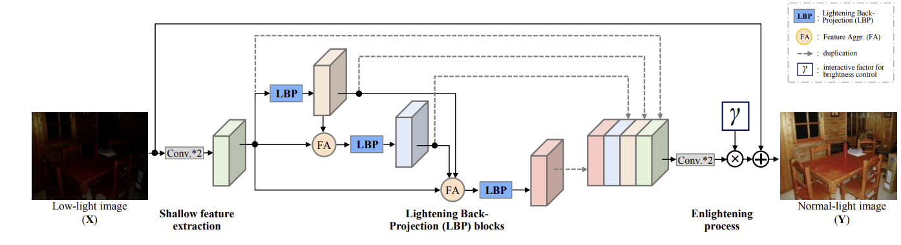

# DLN (Lighting Network for Low-Light Image Enhancement) - Jax/Flax implementation
Original: Li-Wen Wang, Zhi-Song Liu, Wan-Chi Siu, and Daniel P. K. Lun
Modified: Mateus G. Machado

This repo provides the Jax/Flax implementation of DLN based on the [original repo](https://github.com/WangLiwen1994/DLN).
I followed the same code structure, neural networks architecture, and hyper-parameters of the original PyTorch Code.
My entire report is available [here](report.pdf).

## Complete Architecture - From original Repo
The complete architecture of Deep Lighten Network (DLN) is shown as follows,
The rectangles and cubes denote the operations and feature maps respectively.



### Dataset
- Download the VOC2007 dataset and put it to "datasets/train/VOC2007/" and "datasets/test/VOC2007/".
- Download the LOL dataset and put it to "datasets/train/LOL" and "datasets/test/LOL".

### Training
You can choose rather to fine-tune your pre-trained model or to train one from 0.
I've made a version using flax.linen and another with flax.nnx.
The one with flax.linen is complete with model saving, wandb tracking fully working etc etc.
I didn't extensevely try the NNX, but it seems PyTorch code.

To run linen pre-train:

```bash
python train.py --seed 42 --output models/DLN-pre
```

And for fine-tune:
```bash
python train.py --seed 42 --model-folder models/DLN-pre --fine-tune True
```

### Testing
I only made the inference script for the linen model.
You can run it with:
```bash
python test.py --image-dataset datasets/test/LOL/low/ --model-folder models/DLN --output results
```

## BibTex
```
@ARTICLE{DLN2020,
  author={Li-Wen Wang and Zhi-Song Liu and Wan-Chi Siu and Daniel P.K. Lun},
  journal={IEEE Transactions on Image Processing}, 
  title={Lightening Network for Low-light Image Enhancement}, 
  year={2020},
  doi={10.1109/TIP.2020.3008396},
}
```